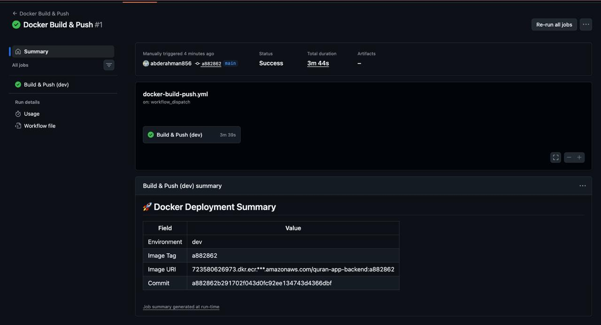
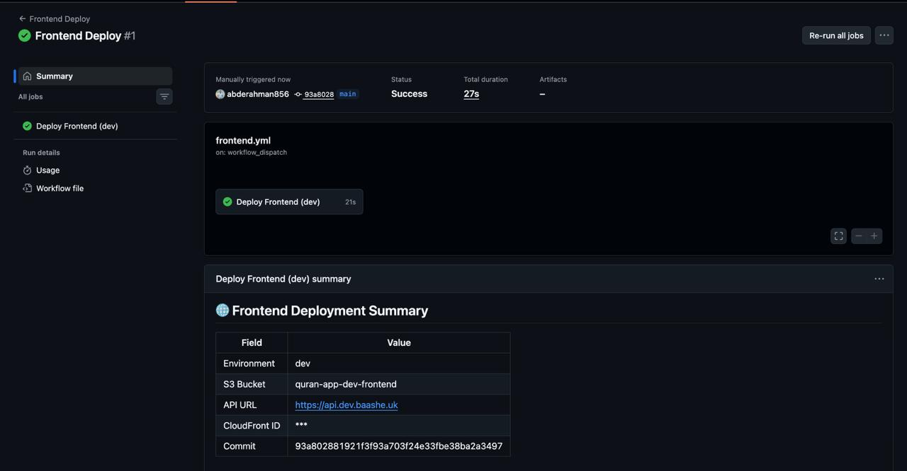
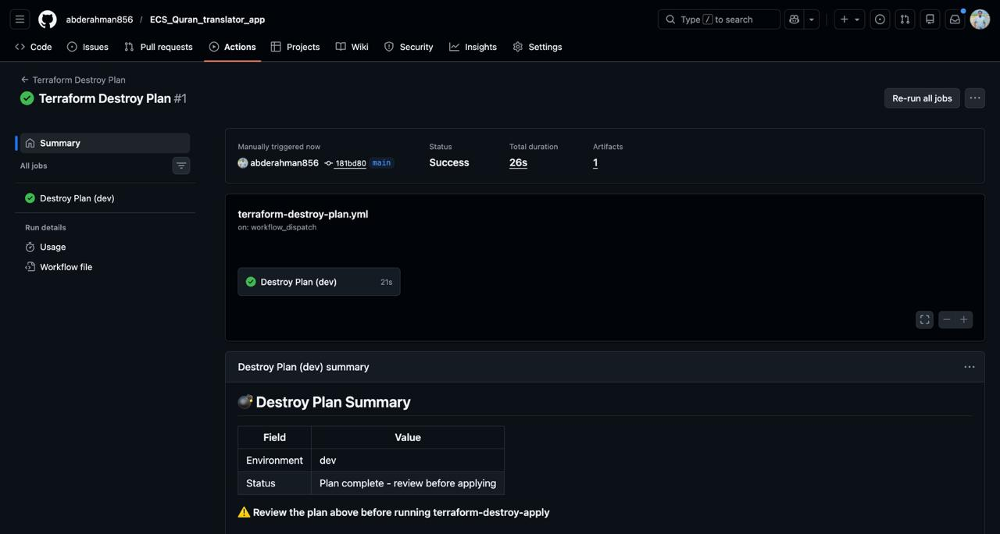
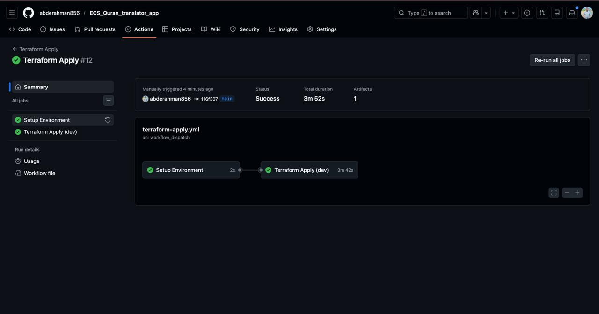
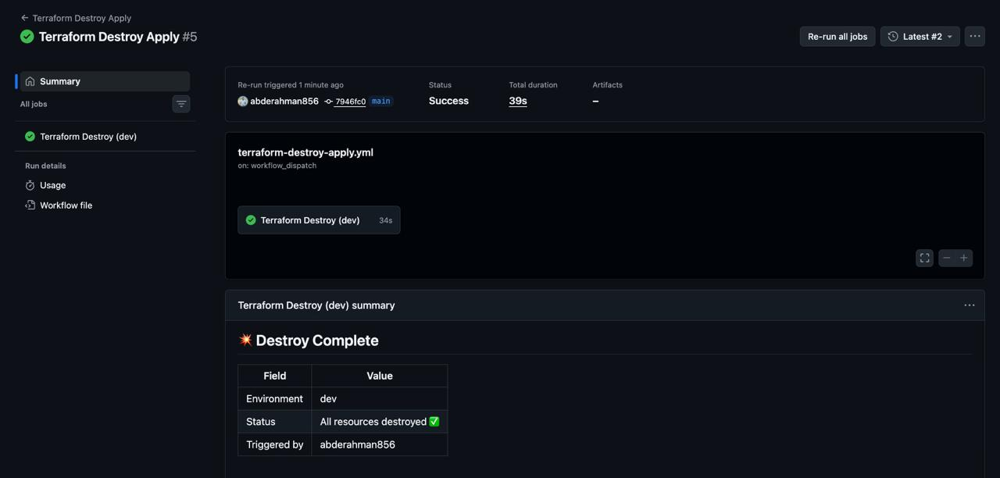
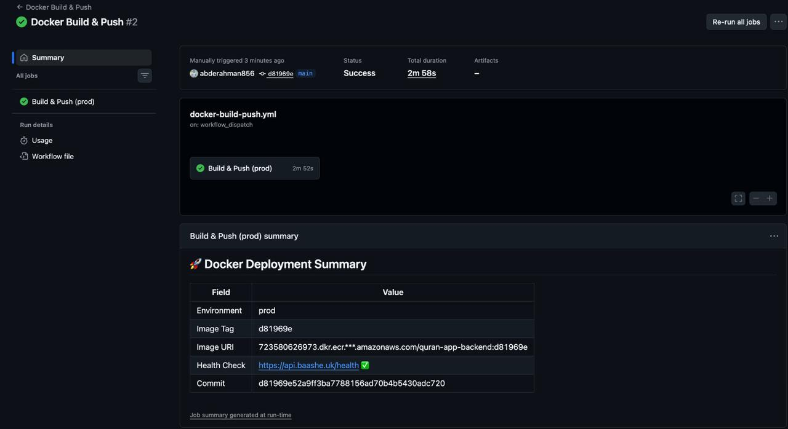
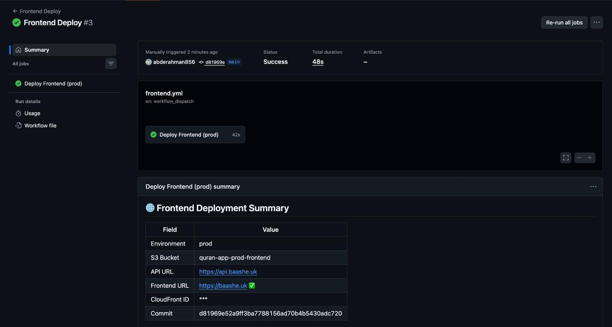
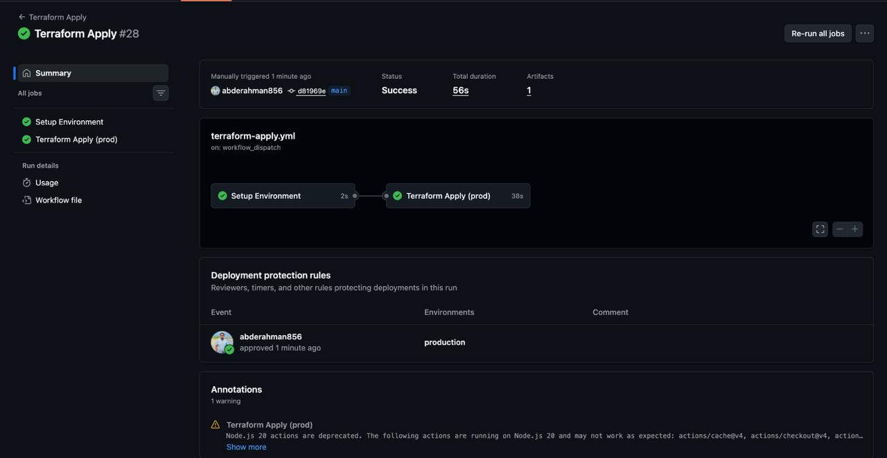
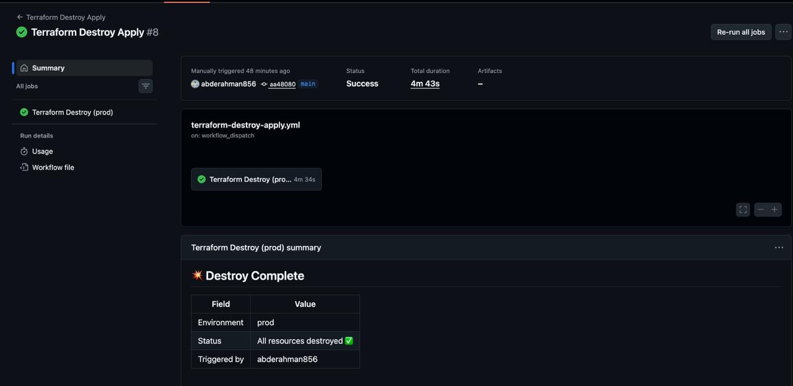

# Quran Application Translator, Cloud_Native Web Application

### Description

A cloud-native web application that allows users to search for Quran verses by Surah and Ayah number and instantly retrieve their translations using an external Quran API.

The application is fully containerized with Docker and deployed on AWS using Terraform, showcasing modern DevOps practices such as Infrastructure as Code, container orchestration with ECS Fargate, load balancing with ALB, and centralized logging with CloudWatch.

This project demonstrates how to design and deploy a scalable and production-ready cloud architecture for a full-stack application.

## Table of Contents

* [Live Demo](https://github.com/abderahman856/ECS_Quran_translator_app?tab=readme-ov-file#live-demo)
* [Architecture](#architecture)
* [Technology Stack](#technology-stack)
* [Repository Structure](#repository-structure)
* [Features](#features)
* [Local Development](#local-development)
* [Author](#author)
* [Contributing](https://github.com/abderahman856/ECS_Quran_translator_app?tab=readme-ov-file#contributing)


## Live Demo

The application is deployed in a production-style cloud environment using AWS ECS Fargate, Application Load Balancer, and Terraform Infrastructure as Code.

Application URL:
https://baashe.uk

### How to Test

  Open the application using the link above.
  
  Enter a Surah number and Ayah number.
  
  The application fetches the verse translation from the Quran API and displays the result instantly.

## Architecture 


## Technology Stack

This project leverages a modern, cloud_native technology stack to ensure scalability, reliability, and maintainability.

### Frontend

* **React.js** ; Builds a dynamic and responsive user interface.
* **JavaScript (ES6+)** ; Core language for frontend logic and interactivity.

### Backend

* **Node.js** ; Runtime environment for executing server_side logic.
* **Express.js** ; Lightweight framework for building REST APIs.
* **Axios** ; Handles HTTP requests to the external Quran API.

### Containerization

* **Docker** ; Packages the application into portable containers.
* **Docker Compose** ; Manages multi-container setup for local development.

### Cloud & Infrastructure

* **AWS ECS (Fargate)** ; Runs containers without managing servers.
* **Amazon ECR** ; Stores Docker images securely.
* **Application Load Balancer (ALB)** ; Distributes traffic across services.
* **AWS CloudWatch** ; Logging and monitoring for application health.

### Infrastructure as Code (IaC)

* **Terraform** ; Provisions and manages cloud infrastructure using code.
* **Modular Terraform Design** ; Ensures reusable and maintainable infrastructure.

### CI/CD & Automation

* **GitHub Actions** ; Automates build, test, and deployment pipelines.
* **OIDC Authentication** ; Secure access to AWS without storing credentials.

### Networking & Security

* **VPC (Virtual Private Cloud)** ; Isolated network environment in AWS.
* **Security Groups** ; Control inbound and outbound traffic.
* **ACM (AWS Certificate Manager)** ; Manages SSL/TLS certificates for HTTPS.

### DNS & CDN

* **Cloudflare** ; Domain management, DNS routing, and CDN for improved performance and security.

### External Services

* **Quran API (alquran.cloud)** ; Provides Quran verse data and translations.

## Repository Structure

### Project Layout

```bash
quran-translator-app/
│
├── .github/
│   └── workflows/                     
│       ├── docker-build-push.yml     
│       ├── frontend.yml              
│       ├── terraform-plan-pr.yml     
│       ├── terraform-apply.yml       
│       ├── terraform-destroy-apply.yml
│       ├── terraform-destroy-plan.yml
│       └── terraform-unlock-state.yml 
│
├── Infra/                             
│   ├── acm/                          
│   ├── alb/                           
│   ├── cloudflare/                    
│   ├── cloudfront/                    
│   ├── cloudwatch/                   
│   ├── ecr/                           
│   ├── ecs/                           
│   ├── envs/                          
│   ├── gateway_endpoint/             
│   ├── s3/                            
│   ├── security_groups/              
│   ├── vpc/                           
│   ├── main.tf                        
│   ├── variables.tf                   
│   ├── outputs.tf                    
│   ├── backend.tf                     
│   └── README.md                     
│
├── app/                               
│   ├── frontend/                      
│   └── backend/                      
│
├── bootstrap/                         
│   ├── oidc/                          
│   ├── main.tf                       
│   ├── provider.tf                    
│   ├── variables.tf                  
│   └── outputs.tf                     
│
├── docs/                              
│   ├── CI_CD_pipelines/               
│   │   ├── dev_environment/           
│   │   └── prod_environment/         
│   ├── Manual_Clickops/               
│   ├── containers/                   
│   ├── developing_the_app_locally/   
│   └── Architecture_diagram.gif      
│
├── docker-compose.yml                 
├── package.json                       
├── package-lock.json                  
├── .dockerignore                      
├── .gitignore                         
├── .pre-commit-config.yaml            
└── README.md                          
```

## Features

### Application Features

*  **Search Quran Verses**
  Users can retrieve Quran verses by entering **Surah number** and **Ayah number**.

*  **Real-Time Translation Fetching**
  Fetches translation data dynamically from an external Quran API.

*  **Fast and Responsive UI**
  Built with React to ensure smooth and interactive user experience.

*  **Simple and Intuitive Workflow**
  Minimal input required to get instant results.

---

### DevOps & Infrastructure Features

*  **Containerized Architecture**
  Frontend and backend are packaged as Docker containers.

*  **Serverless Container Deployment**
  Deployed on AWS ECS Fargate without managing servers.

*  **Load Balancing**
  Application Load Balancer distributes traffic efficiently.

*  **Secure HTTPS Communication**
  SSL/TLS enabled using AWS Certificate Manager.

*  **Container Registry Integration**
  Docker images are stored and managed in Amazon ECR.

*  **Centralized Logging & Monitoring**
  CloudWatch collects logs and metrics for observability.

*  **Infrastructure as Code (IaC)**
  Entire infrastructure is provisioned using Terraform modules.

*  **CI/CD Automation**
  GitHub Actions pipelines automate build, push, and deployment workflows.

*  **Secure Authentication (OIDC)**
  Eliminates static credentials by using OpenID Connect for AWS access.

*  **Custom Domain & DNS Management**
  Managed via Cloudflare with optional CDN capabilities.

---

### Operational Features

*  **Scalable Architecture**
  Automatically handles traffic scaling using ECS and ALB.

*  **Network Isolation**
  Application runs inside a VPC with controlled access via Security Groups.

* **Health Checks & Self Healing**
  ECS and ALB monitor container health and replace unhealthy tasks.

*  **Modular Infrastructure Design**
  Terraform modules ensure reusable and maintainable infrastructure.

#  **Local Development**

Run the application locally with a production_like setup using containers.

---

##  **Prerequisites**

* Docker
* Docker Compose
* Node.js (optional)

---

##  **Setup Guide**

###  1. Clone Repository

```bash
git clone https://github.com/your-username/quran-translator-app.git
cd quran-translator-app
```

---

###  2. Configure Environment Variables

Create a `.env` file inside `app/backend`:

```env
PORT=5000
QURAN_API_BASE_URL=https://api.alquran.cloud/v1/ayah
```

---

###  3. Run Application

```bash
docker-compose up --build
```

---

###  4. Access Services

* Frontend → http://localhost:3000
* Backend → http://localhost:5000

---

###  Health Check

```bash
curl http://localhost:5000/health
```

---

#  **CI/CD Pipeline Execution (Dev & Prod)**
---

##  **Development Environment**

###  Build & Push Image



---

###  Deploy Frontend & Backend



---

###  Destroy Infrastructure



---

###  Terraform Apply



---

###  Terraform Destroy



---

##  **Production Environment**

###  Build & Push Image



---

###  Deploy Application



---

###  Terraform Apply



---

###  Terraform Destroy



---

#  **Learning Outcomes**

This project demonstrates hands-on experience in building and deploying modern cloud-native applications.

---

##  **CI/CD & Automation**

* Designed end_to_end pipelines using GitHub Actions
* Automated build, test, and deployment workflows
* Managed separate pipelines for app and infrastructure

---

##  **Containerization**

* Built optimized multi_stage Docker images
* Managed multi_container applications
* Implemented production-ready container practices

---

##  **Cloud & Infrastructure**

* Deployed applications on AWS ECS Fargate
* Configured ALB, networking, and security groups
* Designed scalable and fault-tolerant architecture

---

##  **Infrastructure as Code**

* Built modular Terraform architecture
* Managed remote state and environments
* Applied real world infrastructure patterns

---

##  **Networking & Delivery**

* Integrated DNS and CDN via Cloudflare
* Configured HTTPS and secure routing
* Understood full request lifecycle

---

##  **Monitoring & Debugging**

* Used CloudWatch for logs and metrics
* Implemented health checks and alerts
* Debugged real-world deployment issues

---

#  **Author**

**Abdurahman Saeed**
 DevOps Engineer

---

##  **Connect**

* GitHub: https://github.com/abderahman856
* LinkedIn: https://www.linkedin.com/in/abdurahman12/

---

##  **About**

This project represents a full DevOps journey:

```
Development → Docker → CI/CD → Terraform → AWS → Monitoring
```
---

#  **Contributing**
---

##  **How to Contribute**

1. Fork the repository
2. Create a new branch

```bash
git checkout -b feature/your-feature-name
```

3. Make your changes
4. Commit your work

```bash
git commit -m "Add new feature"
```

5. Push to your branch

```bash
git push origin feature/your-feature-name
```

6. Open a Pull Request


