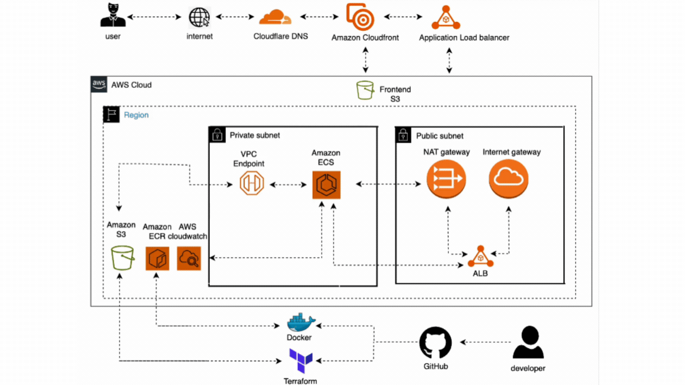

# Quran Application Translator, Cloud-Native Web Application

### Description

A cloud-native web application that allows users to search for Quran verses by Surah and Ayah number and instantly retrieve their translations using an external Quran API.

The application is fully containerized with Docker and deployed on AWS using Terraform, showcasing modern DevOps practices such as Infrastructure as Code, container orchestration with ECS Fargate, load balancing with ALB, and centralized logging with CloudWatch.

This project demonstrates how to design and deploy a scalable and production-ready cloud architecture for a full-stack application.

## Table of Contents

* [Live Demo](https://github.com/abderahman856/ECS_Quran_translator_app?tab=readme-ov-file#live-demo)
* [Architecture](#architecture)
* [Technology Stack](#technology-stack)
* [Infrastructure Overview](#infrastructure-overview)
* [Terraform Modules](#terraform-modules)
* [Repository Structure](#repository-structure)
* [Features](#features)
* [Deployment Process](#deployment-process)
* [Local Development](#local-development)
* [Future Improvements](#future-improvements)
* [Learning Outcomes](#learning-outcomes)
* [Author](#author)

## Live Demo

The application is deployed in a production-style cloud environment using AWS ECS Fargate, Application Load Balancer, and Terraform Infrastructure as Code.

🌐 Application URL:
https://baashe.uk

### How to Test

  Open the application using the link above.
  
  Enter a Surah number and Ayah number.
  
  The application fetches the verse translation from the Quran API and displays the result instantly.

### Architecture 

